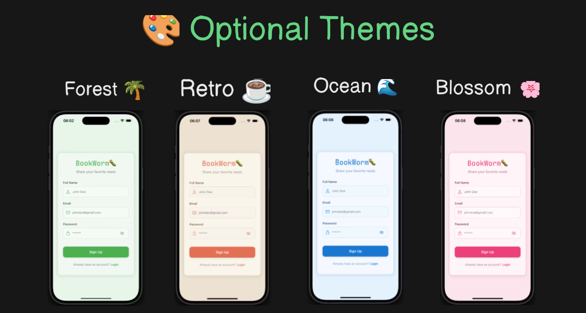

# 📚 BookWorm

This is the **frontend** of the Book Recommendation App, built using **React Native** and **Expo**. The app allows users to sign up, log in, create book recommendations, view posts, and manage their profile.

## 🔗 Live Links
- **Backend Repository:** [Click Here](https://github.com/sudo-dpkg/bookworm-backend)  
- **Download Apk:** [APK Download](https://github.com/sudo-dpkg/bookworm/releases/tag/v1)  

## 🚀 Features
- User authentication (Sign Up & Login)
- Infinite scrolling for seamless post loading
- Create, view, and delete book recommendations
- Profile management with user-specific posts
- Supports **Android, and Web** using Expo
- Multiple theme options with easy customization

## 🛠️ Tech Stack
- **Frontend:** React Native, Expo
- **State Management:** React Hooks
- **Navigation:** React Navigation
- **API Calls:** Fetch API (to communicate with the backend)

